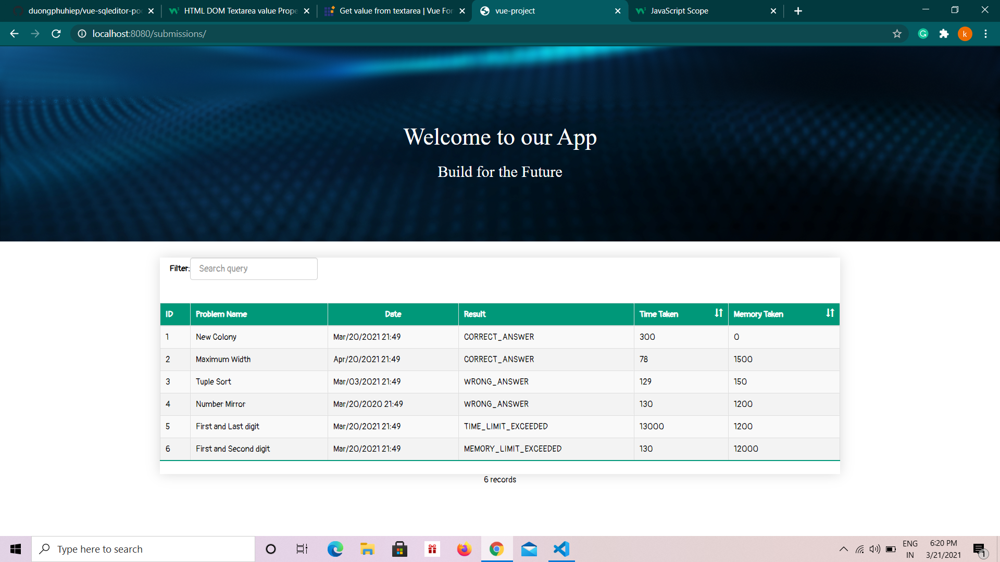
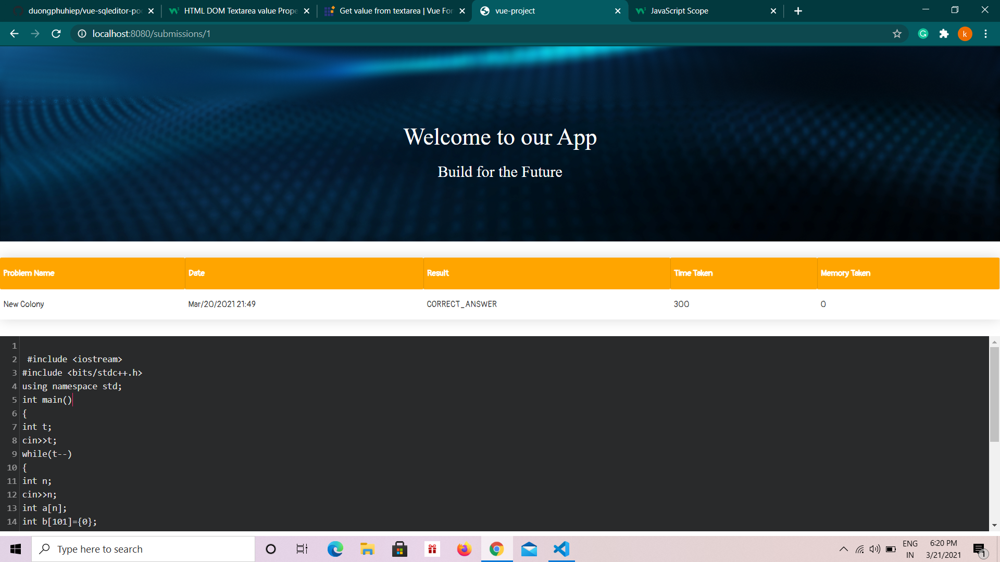

# Problem Statement

 Write a simple website for browsing all solutions submitted during a coding contest. Your submission should have two pages:

## How to start this application

#Clone the repository
git clone https://github.com/KanishkaJain30/Vue-app

cd Vue-app

## Install dependencies
npm install

Change db.json file in config folder this file is located in data/db.json

## Start he JSON server using the following command
json-server --watch data/db.json --port 4000

## Serve with hot reload at localhost:8080
npm run dev

## Build for production with minification
npm run build

## Snapshots



```

For detailed explanation on how things work, consult the [docs for vue-loader](http://vuejs.github.io/vue-loader).
